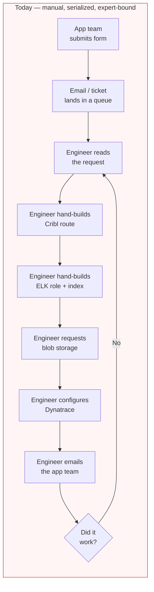
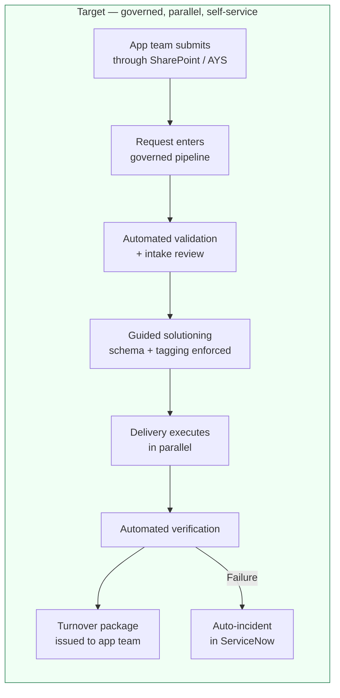
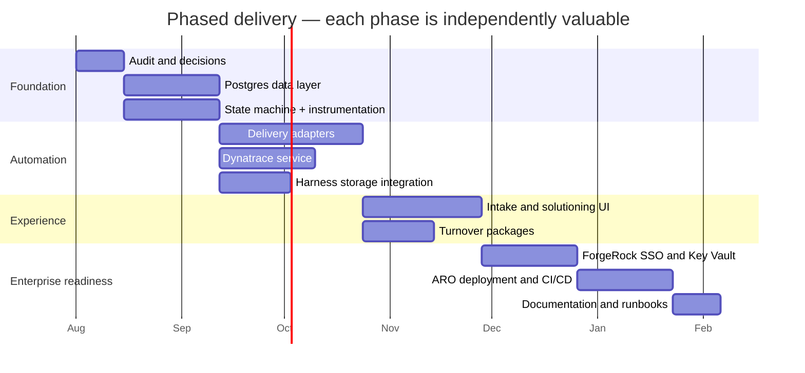
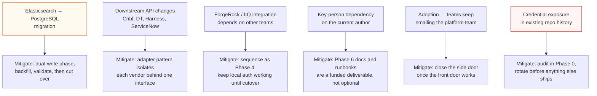

# Observability Onboarding Service — Business View

**Audience:** platform leadership, product owners, funding approvers
**Question this answers:** what changes for the business, and how do we know it worked

---

## 1. The problem in one picture

Onboarding an application into the observability platform today is a manual, expert-dependent
process. A request arrives through a form, and a small number of platform engineers translate it
by hand into Cribl routes, Elasticsearch roles, blob containers, and Dynatrace configuration —
each in a different tool, each with its own failure mode.

Every arrow above is a handoff, and every handoff is a place where the request waits. The engineer
is the integration layer.

---

## 2. What we are building instead

The engineer stops being the integration layer and becomes the reviewer of an automated one.

---

## 3. Capability map — what becomes possible

```mermaid
flowchart TD
    ROOT["Observability Onboarding Service"]

    ROOT --> C1["Self-service intake"]
    ROOT --> C2["Governed solutioning"]
    ROOT --> C3["Automated delivery"]
    ROOT --> C4["Lifecycle management"]
    ROOT --> C5["Audit and compliance"]

    C1 --> C1a["Single front door via SharePoint / AYS"]
    C1 --> C1b["Request status visible to the requester"]
    C1 --> C1c["No engineer needed to accept work"]

    C2 --> C2a["Standard onboarding workbook"]
    C2 --> C2b["Schema and tagging enforced at intake"]
    C2 --> C2c["Entity and field mapping captured once"]

    C3 --> C3a["Cribl routes and destinations"]
    C3 --> C3b["ELK roles, indexes, ILM tiers"]
    C3 --> C3c["Azure Blob container and retention"]
    C3 --> C3d["Dynatrace zones and agents"]

    C4 --> C4a["Live service catalog of every onboarded app"]
    C4 --> C4b["Offboarding that actually removes everything"]
    C4 --> C4c["Re-onboarding and config drift correction"]

    C5 --> C5a["Immutable audit trail per request"]
    C5 --> C5b["Who approved what, and when"]
    C5 --> C5c["Entitlement lookup across all clusters"]
```

Three of these five capabilities partially exist today in the current framework. The upgrade
completes them and adds the two that do not exist at all: governed solutioning and full
lifecycle management.

---

## 4. Value drivers

| Driver | Mechanism | Who benefits |
|---|---|---|
| **Cycle time reduction** | Parallel delivery execution replaces serialized manual steps | App teams waiting to ship |
| **Engineer capacity recovered** | Routine onboarding stops consuming senior engineer hours | Platform team; frees time for architecture work |
| **Consistency** | Every app gets the same route shape, role shape, retention tier | Operations; fewer one-off configurations to support |
| **Cost control** | Retention tier is a required, governed field — not an afterthought | Finance; storage and ingest spend become predictable |
| **Reduced rework** | Validation at intake catches bad requests before delivery starts | Both sides; fewer round-trips |
| **Audit readiness** | Immutable state transitions and entitlement records | Compliance, internal audit |
| **Offboarding hygiene** | Automated teardown of routes, roles, and containers | Security; removes orphaned access and orphaned spend |

---

## 5. Measurement — instrument these, do not assume them

The numbers below are **placeholders for a baseline you should measure before Phase 1 ships.**
Claiming a specific percentage improvement before measuring the current state is how platform
projects lose credibility at the second review.

| Metric | How to capture | Baseline | Target |
|---|---|---|---|
| Median time from request submitted → delivered | State transition timestamps | *measure* | *set after baseline* |
| 90th percentile time to deliver | Same | *measure* | *set after baseline* |
| Engineer-hours per onboarding | Time tracking or sampled estimate | *measure* | *set after baseline* |
| Requests requiring rework | Count of `INTAKE_ENGAGEMENT` revision loops | *measure* | *set after baseline* |
| Delivery task failure rate, by adapter | `DeliveryTask` status | n/a — new | < 5% |
| Apps in catalog with drifted config | Catalog reconciliation scan | unknown today | trend to zero |
| Orphaned resources after offboarding | Offboard verification step | unknown today | zero |
| Percentage of requests fully self-service | Requests with no manual intervention | ~0% | *set after baseline* |

The state machine gives you these for free once Phase 1 lands — every transition is timestamped
and attributed. That instrumentation is itself a deliverable worth funding.

---

## 6. Delivery roadmap

Durations are planning estimates, not commitments. Sequence matters more than duration — the
Postgres layer gates everything downstream because it is where measurement lives.

---

## 7. What lands when

| Phase | Business outcome available at the end of the phase |
|---|---|
| **0 — Audit** | Honest inventory of the current platform, including security debt. Decision record for leadership sign-off. |
| **1 — Data layer** | Every request measurable end to end. Reporting on cycle time becomes possible for the first time. |
| **2 — Delivery adapters** | Delivery runs in parallel and is repeatable. Failure is visible per sub-task rather than as one opaque error. |
| **3 — Intake and solutioning** | App teams self-serve. Schema and tagging discipline enforced at source, not corrected later. |
| **4 — Auth and secrets** | Enterprise SSO, no shared local accounts, no credentials on disk. Audit-defensible. |
| **5 — ARO and CI/CD** | Production-grade hosting, standard deployment path, rollback capability. |
| **6 — Documentation** | Operable by the whole team, not just the author. Removes a key-person dependency. |

Phases 0, 1, and 4 are worth doing even if the rest is deferred — measurement and security debt
retirement stand alone.

---

## 8. Risks, stated plainly

Risk 6 is not theoretical — the Phase 0 audit exists specifically to confirm or clear it, and it
should be resolved before any other work is funded.

---

## 9. What this does not solve

Being explicit here protects the project from being blamed for problems it was never scoped to fix.

- It does not reduce **ingest volume or storage cost by itself**. It makes retention tier a
  governed decision, which enables cost work — it does not perform that work.
- It does not replace **capacity planning** for the Cribl or Elasticsearch estates.
- It does not fix **application-side logging quality**. Enforcing a schema at onboarding raises
  the floor; it does not make a noisy application quiet.
- It does not eliminate the **engineering review step** for complex or high-volume onboardings.
  It removes review from routine ones.
- It is not a **replacement for ServiceNow**. It integrates with AYS; it does not compete with it.
