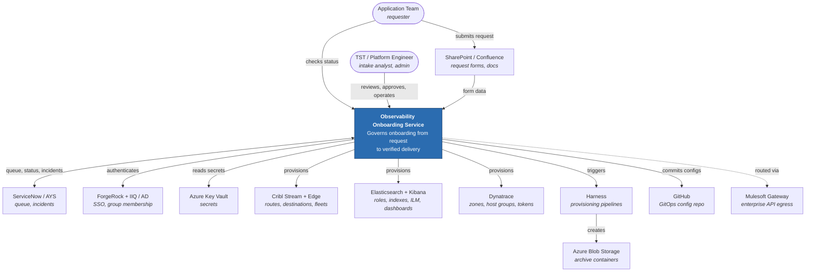
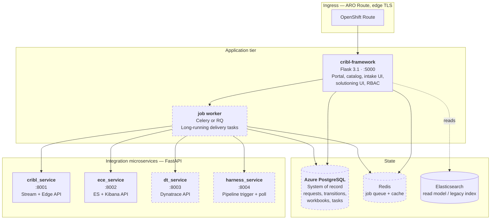
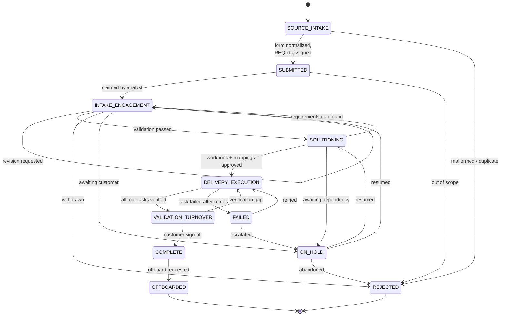
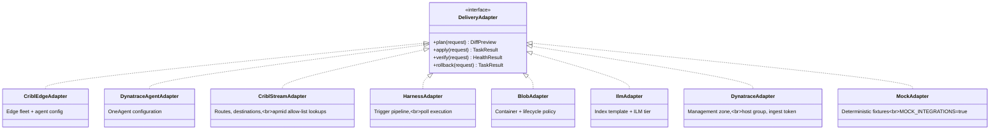
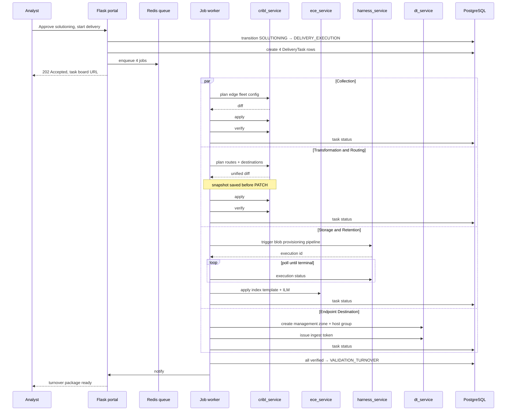
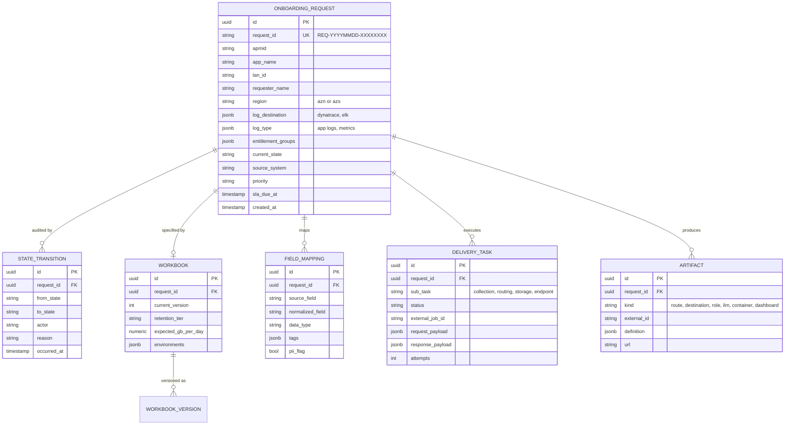
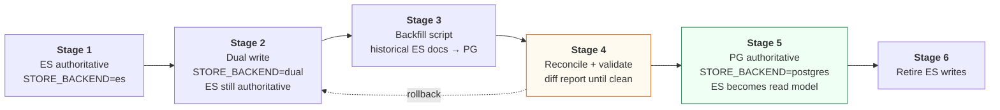
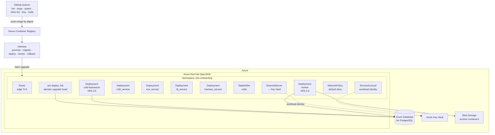
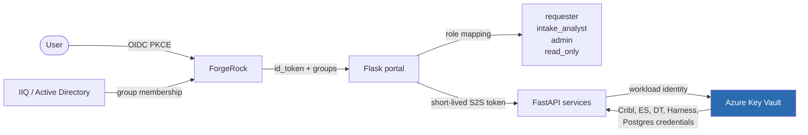
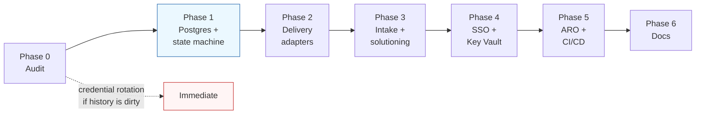

# Observability Onboarding Service — Engineering View

**Audience:** platform engineers, architects, reviewers
**Question this answers:** what the system is, how the pieces fit, and what changes from today

---

## 1. C4 Level 1 — System context



---

## 2. C4 Level 2 — Containers

Current containers in solid boxes, new containers dashed.



**What changes from today:** Postgres replaces the Elasticsearch index as system of record; a job
worker moves long-running delivery off the request thread; two new microservices follow the
existing `cribl_service` pattern rather than inventing a new one.

**What stays:** the Flask portal, both existing FastAPI services, the shared modules
(`cribl_api.py`, `cribl_config.py`, `cribl_utils.py`, `cribl_logger.py`, `otel_setup.py`), and both
CLIs. `cribl-pusher.py` and `role_rm.py` get refactored into importable functions with thin
`argparse` wrappers — the flags do not change.

---

## 3. Onboarding lifecycle state machine



Every transition writes an immutable `StateTransition` row: actor, timestamp, from, to, reason.
The legal-transition table lives in one module and is unit-tested for both legal and illegal moves.
This is the source of all cycle-time measurement.

---

## 4. Delivery Execution Layer

Four sub-tasks, each behind one adapter interface, each independently retryable.



Mapping to the four sub-tasks:

| Sub-task | Adapters | Reuses |
|---|---|---|
| Collection | `CriblEdgeAdapter`, `DynatraceAgentAdapter` | `cribl_service` async edge routers |
| Transformation & Routing | `CriblStreamAdapter` | `cribl-pusher.py` logic, route templates, snapshots |
| Storage & Retention | `HarnessAdapter`, `BlobAdapter`, `IlmAdapter` | `blob_dest_template_*.json`, `ece_service` ILM router |
| Endpoint Destination | `DynatraceAdapter` | new — `dt_service` |

### Why `plan / apply / verify / rollback`

The existing framework already has the right instincts — diff preview, dry run, minimum-route
checks, no-shrink guard, rollback snapshots. The interface generalizes those guarantees so every
new integration inherits them instead of reimplementing them. An adapter that cannot produce a
`plan()` diff does not ship.

---

## 5. Delivery sequence



On any task failure after retries the request moves to `FAILED`, the failing sub-task is recorded,
and an incident is opened in AYS. Successful sibling tasks are **not** rolled back automatically —
partial state is visible and an operator decides. Automatic cascading rollback across four vendor
systems is more dangerous than the partial state it would clean up.

---

## 6. Data model



`apmid` is indexed as a first-class column. This removes an entire class of bug that exists today —
the ES index maps `apmid` as `text`, which is why `_update_by_query` on `apmid.keyword` silently
returns `updated: 0` when the index template has not been applied.

---

## 7. Migration strategy — Elasticsearch to PostgreSQL



Stage 4 is the gate. Do not advance until the reconciliation diff is empty across a full
onboarding cycle. The rollback path from Stage 4 back to Stage 2 is a single config flag —
that is the entire reason for the dual-write stage.

---

## 8. Deployment topology on ARO



Container requirements for OpenShift specifically: non-root, arbitrary UID tolerant, group 0 write
permissions on any writable path, no `USER 0`, no assumptions about a fixed UID in the Dockerfile.
The current `python:3.13-slim` image will need adjusting.

---

## 9. Security model



**This replaces local accounts in `config.json` entirely.** Today the config file holds usernames
and plaintext passwords for both admin and user roles, plus Cribl and Elasticsearch credentials.
Preserve the existing page-access matrix during cutover — map the current `user` role to
`requester` and `admin` to `admin` — but the credential store itself goes away.

Config after this change holds **secret names, never secret values.**

---

## 10. Observability of the service itself

The existing OTLP path stays and is extended:

```
app services ──OTLP──> Cribl Edge ──> Logstash ──> Elasticsearch ──> Kibana
                            │
                            └──> optional direct routing
```

Additions:
- Trace context propagated across Flask → queue → worker → adapter → vendor API. The `request_id`
  becomes a span attribute so a single onboarding is one trace end to end.
- Prometheus `/metrics` per service: delivery task duration by adapter, failure count by adapter,
  queue depth, state-transition counts.
- `/healthz` and `/readyz` split — readiness gates on Postgres and Redis, liveness does not.
- Structured JSON logs with `request_id`, `apmid`, `trace_id`, `span_id` on every line.

---

## 11. Testing strategy

| Layer | What | Runs where |
|---|---|---|
| Unit | State machine legal/illegal transitions, template rendering, diff logic | CI, every commit |
| Contract | Each adapter against its mock; response shape assertions | CI, every commit |
| Integration | Full stack with `MOCK_INTEGRATIONS=true`, real Postgres and Redis | CI, every commit |
| Migration | Alembic upgrade + downgrade against a seeded database | CI, every commit |
| Smoke | Post-deploy health and one dry-run onboarding | Harness, every deploy |
| Manual | Real dry-run against non-prod Cribl and ELK | Before prod promotion |

The mock adapters are what make CI meaningful. Without them nothing beyond unit tests can run
without live vendor systems, which is the current situation.

---

## 12. Sequencing rationale



Phase 1 is the keystone: the state machine is what makes delivery orchestratable and what makes
every business metric in the leadership deck measurable. Phase 2 depends on `DeliveryTask` rows
existing. Phase 3 depends on `Workbook` and `FieldMapping`. Nothing meaningful can be sequenced
before it.

Phase 0 can surface work that jumps the queue. If credentials are in git history, rotation happens
before anything else ships.
