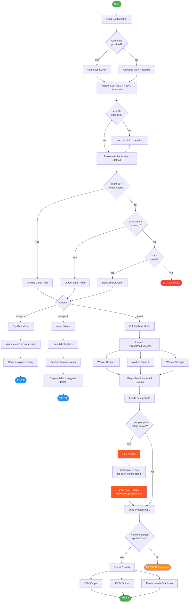
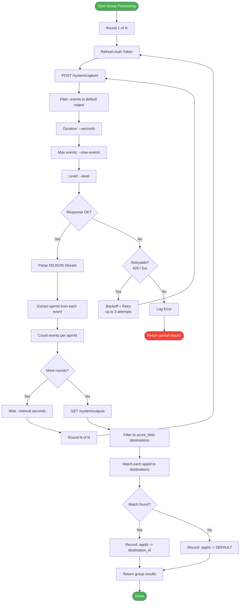
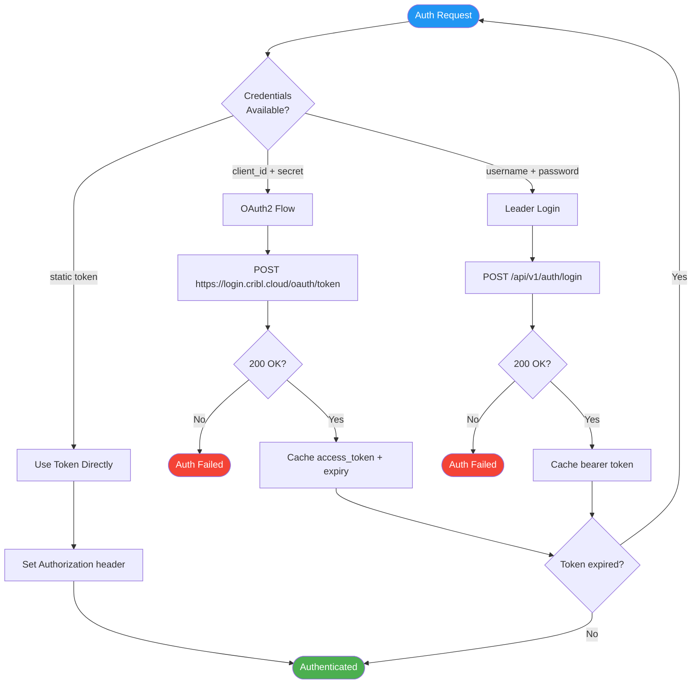
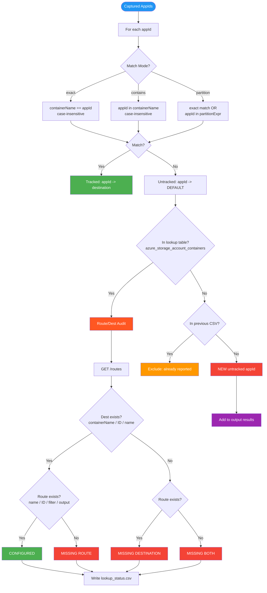
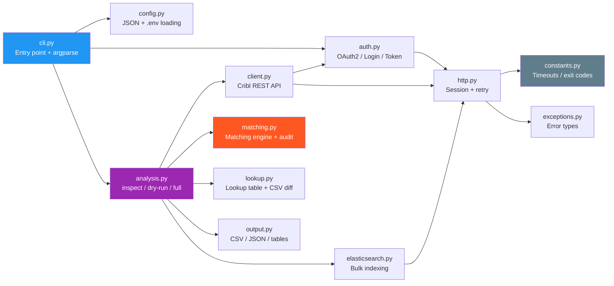
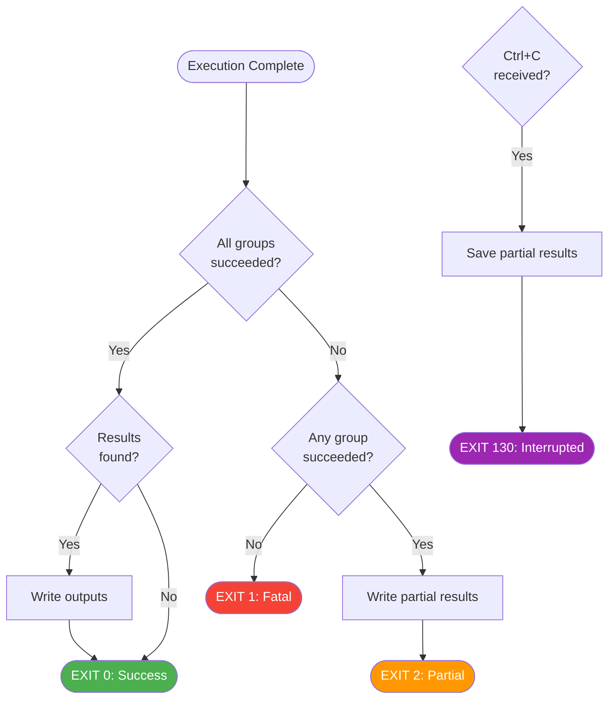

# Untracked AppId Detector — Flowcharts

## 1. Main Application Flow

---

## 2. Per-Worker-Group Capture Flow

---

## 3. Authentication Flow

---

## 4. Matching & Deduplication Flow

---

## 5. Package Architecture

---

## 6. Error Handling & Exit Codes

---

## How to Render

These diagrams use [Mermaid](https://mermaid.js.org/) syntax. They render natively in:
- GitHub / GitLab Markdown viewers
- VS Code with the Mermaid extension
- [Mermaid Live Editor](https://mermaid.live)
- Confluence with Mermaid macro
- Jira with Mermaid add-on
