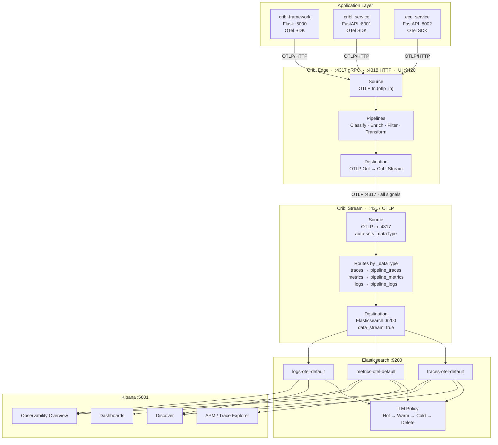
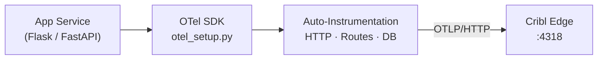
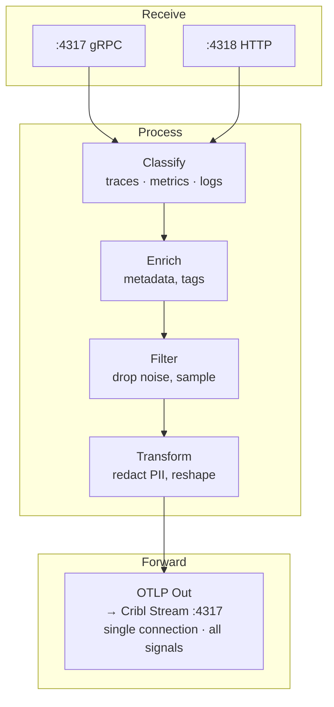
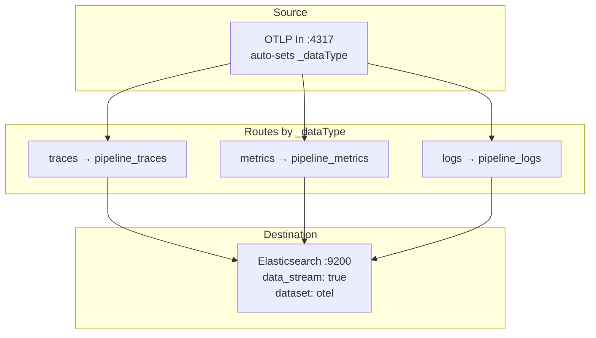
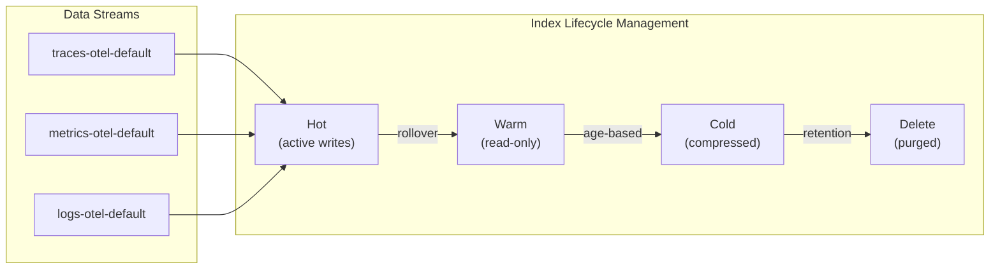
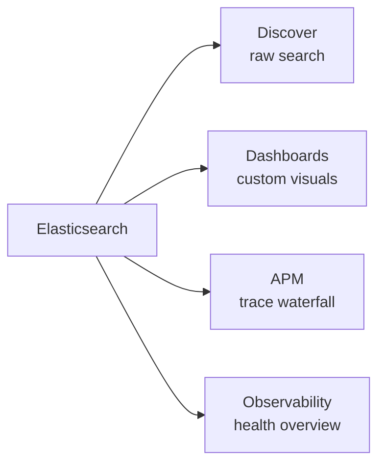

# OTLP Observability Pipeline

> **Apps** &rarr; **Cribl Edge** &rarr; **Cribl Stream** &rarr; **Elasticsearch** &rarr; **Kibana**
>
> All telemetry flows over a single OTLP port. Cribl Stream auto-classifies signals via `_dataType` — no manual tagging required.

---

## End-to-End Data Flow



---

## How Signal-Type Tagging Works

OTLP multiplexes all three signal types over a **single port**. The protocol itself separates them — no extra ports, no manual tags.

| Signal | OTLP HTTP Path | OTLP gRPC Service | Cribl `_dataType` |
|:------:|:--------------:|:------------------:|:-----------------:|
| Traces | `/v1/traces` | `TraceService/Export` | `traces` |
| Metrics | `/v1/metrics` | `MetricsService/Export` | `metrics` |
| Logs | `/v1/logs` | `LogService/Export` | `logs` |

Cribl Stream's OTLP source **automatically** populates `_dataType` based on the incoming path/service. Routes then fan out to signal-specific pipelines:

```
Route 1:   _dataType == 'traces'   →  pipeline_traces   →  Elasticsearch
Route 2:   _dataType == 'metrics'  →  pipeline_metrics   →  Elasticsearch
Route 3:   _dataType == 'logs'     →  pipeline_logs      →  Elasticsearch
```

---

## Step-by-Step Breakdown

### Step 1 &mdash; Application Layer: Emit Telemetry



| What happens | Detail |
|:-------------|:-------|
| Instrumentation | Each service calls `otel_setup.py` at startup |
| Auto-capture | Inbound/outbound HTTP, route handlers, DB calls |
| Export format | OTLP protobuf over HTTP to `:4318` |

---

### Step 2 &mdash; Cribl Edge: Receive, Process, Forward



| What happens | Detail |
|:-------------|:-------|
| Receive | OTLP source (`otlp_in`) on gRPC + HTTP |
| Process | Classify by signal, enrich, filter noise, transform/redact |
| Forward | Single OTLP connection carries all signals to Stream |

---

### Step 3 &mdash; Cribl Stream: Route by `_dataType` and Deliver



| What happens | Detail |
|:-------------|:-------|
| Receive | Single OTLP source, all signals on one port |
| Classify | `_dataType` auto-populated — no manual tagging |
| Route | Fan out by `_dataType` to signal-specific pipelines |
| Deliver | Each pipeline writes to Elasticsearch as data streams |

---

### Step 4 &mdash; Elasticsearch: Store and Manage



| What happens | Detail |
|:-------------|:-------|
| Ingest | Data streams auto-create backing indices |
| Lifecycle | ILM handles rollover, compression, retention |
| Availability | Documents are searchable immediately on write |

---

### Step 5 &mdash; Kibana: Visualize and Explore



| Feature | Purpose |
|:--------|:--------|
| **Discover** | Search and filter raw documents across all signals |
| **Dashboards** | Latency, error rate, throughput charts |
| **APM / Trace Explorer** | Distributed trace waterfall views |
| **Observability** | Unified health overview across all signals |

---

## Quick Reference

### Ports

| Service | Port | Protocol | Purpose |
|:--------|:----:|:--------:|:--------|
| Cribl Edge | `4317` | gRPC | OTLP gRPC receiver |
| Cribl Edge | `4318` | HTTP | OTLP HTTP receiver |
| Cribl Edge | `9420` | HTTP | Management UI |
| Cribl Stream | `4317` | gRPC / HTTP | OTLP receiver (all signals, single port) |
| Elasticsearch | `9200` | HTTP | Search and storage API |
| Kibana | `5601` | HTTP | Visualization UI |

### Configuration Files

| File | Purpose |
|:-----|:--------|
| `cribl-edge/local/cribl/sources.yml` | OTLP source config |
| `cribl-edge/local/cribl/destinations.yml` | OTLP output to Cribl Stream |
| `cribl-edge/local/cribl/routes.yml` | Edge data routing rules |
| `cribl-stream/sources.yml` | OTLP source (single port, auto `_dataType`) |
| `cribl-stream/routes.yml` | Routes by `_dataType` to pipelines |
| `cribl-stream/pipelines/` | Signal-specific pipeline configs |
| `cribl-stream/destinations/` | Elasticsearch destination config |
| `elasticsearch.yml` | ES node settings |
